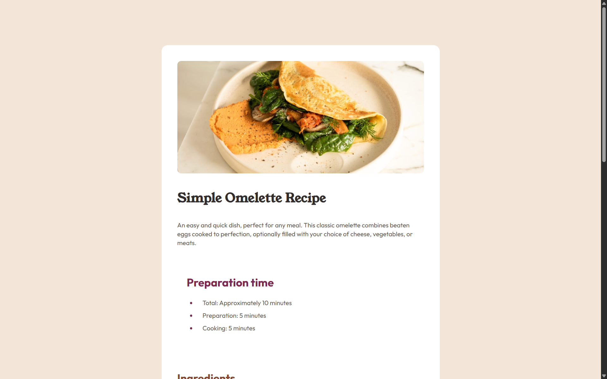

# Frontend Mentor - Recipe page solution

This is a solution to the [Recipe page challenge on Frontend Mentor](https://www.frontendmentor.io/challenges/recipe-page-KiTsR8QQKm). Frontend Mentor challenges help you improve your coding skills by building realistic projects. 

## Table of contents

- [Overview](#overview)
  - [The challenge](#the-challenge)
  - [Screenshot](#screenshot)
  - [Links](#links)
- [My process](#my-process)
  - [Built with](#built-with)
  - [What I learned](#what-i-learned)
  - [Continued development](#continued-development)


## Overview

### Screenshot




### Links

- Live Site URL: https://esisgilz.github.io/recipe-page-main/

## My process

### Built with

- Semantic HTML5 markup
- CSS custom properties
- Flexbox
- CSS Grid


### What I learned

The ues of the strong tag and other html semantic tags that are used by screen readers as well as using figma rectangles to draw out dimensions.

and to use media queries to alter certain properties such as image resizing on smaller screens

```html
<li>
    <strong>Beat the eggs:</strong>
    In a bowl, beat the eggs with a pinch of salt and pepper until they are well mixed. 
    You can add a tablespoon of water or milk for a fluffier texture.
</li>
```


### Continued development

Im going to proceed with moving on to frameworks
